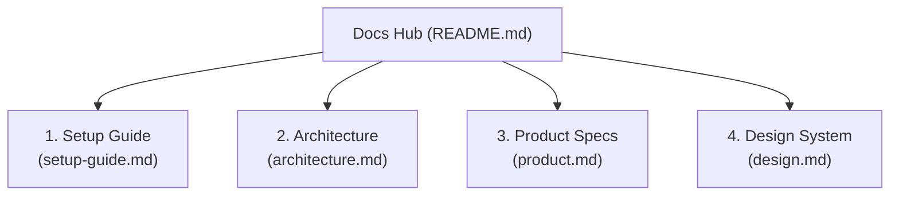

#  Point-of-Sale System Documentation Hub

Welcome to the ** Point-of-Sale System System** documentation. This directory provides comprehensive guides, architecture diagrams, product specifications, and design guidelines for developers, operators, and store owners.

---

## Documentation Navigation

---

### 1. [Setup & Verification Guide](./setup-guide.md)
Step-by-step instructions for initializing the system:
- Creating the Google Sheet database (4 sheets: `Products`, `Sales`, `SaleItems`, `Cashiers`).
- Deploying the Google Apps Script backend as a Web App.
- Configuring the React frontend (via Settings UI or `.env.local`).
- Running manual and automated verification tests.

### 2. [System Architecture](./architecture.md)
Technical specifications of the serverless architecture:
- C4 System Context and Container diagrams.
- Concurrency and transaction lifecycle using Google Apps Script `LockService`.
- API endpoint specifications and CORS preflight handling.
- Full Google Sheets database schema.

### 3. [Product Requirements & Specs](./product.md)
Functional and business requirements:
- Product vision and value proposition (Zero-cost, BYOS POS).
- User personas (Cashier, Store Owner/Manager).
- Core feature breakdown (Register, Quick tender, Receipts, Cashiers, BYOS Hub).
- Business rules and non-functional requirements.

### 4. [Design System & UI/UX Guidelines](./design.md)
Visual identity and interaction design:
- Swiss Minimalism aesthetic with dark-mode foundation (`#020617`).
- Design tokens: colors, typography (Inter + `tabular-nums font-mono`), and spacing.
- Component design specifications (Tap-to-add cards, order panel, cash shortcuts).
- 80mm thermal receipt printer design (`@media print`).
- Accessibility and ergonomic touch target guidelines (≥ 44px).

---

## Quick Links

- [Google Apps Script Backend Code](../google-apps-script/Code.js)
- [Frontend Source Code](../src/components/PosApp.tsx)
- [Automated Integration Test Script](../scripts/test-api.mjs)
