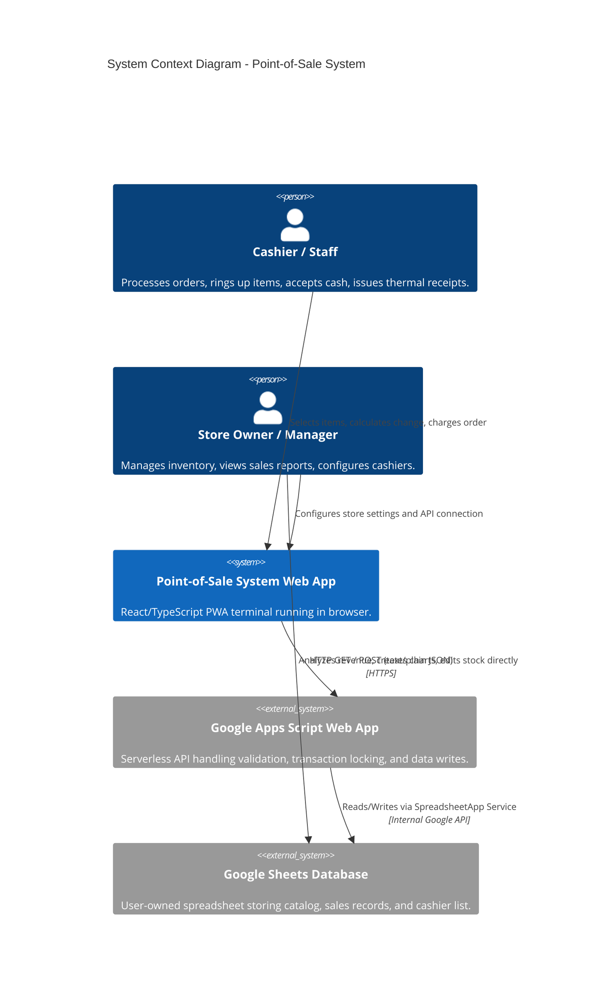
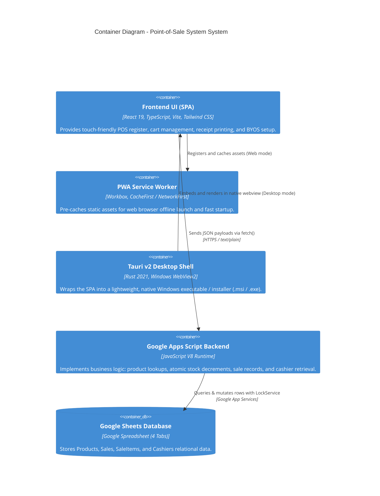
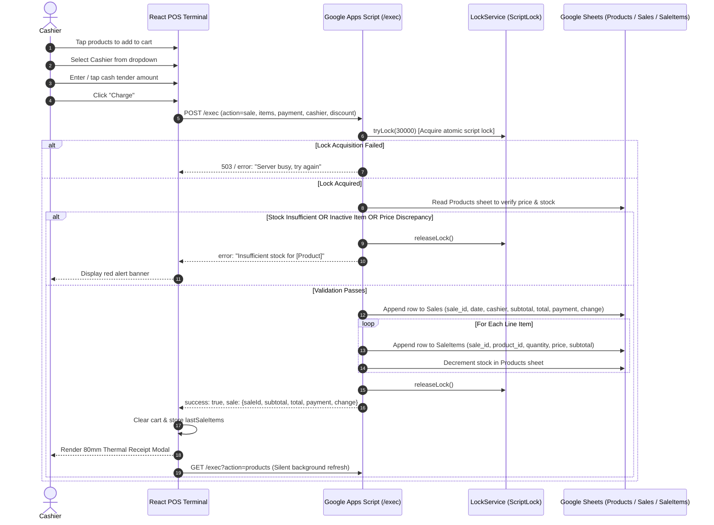

# System Architecture Documentation

This document describes the architectural design, system context, component topology, data flows, and concurrency mechanisms of the ** Point-of-Sale System System**.

---

## 1. System Overview

The Point-of-Sale System is a **serverless, zero-maintenance Point of Sale solution** where:
- The **frontend** is a responsive React/Vite Progressive Web Application (PWA).
- The **backend API** is hosted on **Google Apps Script** as a public Web App (`/exec`).
- The **database** is a private, user-owned **Google Spreadsheet** containing 4 relational sheets (`Products`, `Sales`, `SaleItems`, `Cashiers`).

There are no traditional Node.js, Express, or SQL database servers to maintain, pay for, or provision.

---

## 2. C4 Architecture Models

### 2.1 System Context (Level 1)

---

### 2.2 Container Diagram (Level 2)

---

## 3. Data Flow & Transaction Lifecycle

### 3.1 Checkout & Sale Transaction Flow

To prevent race conditions, double-charging, or negative inventory, the backend implements **pessimistic locking** via Google Apps Script `LockService`.

---

## 4. API Specification

The Google Apps Script Web App serves both `GET` and `POST` requests through the same deployment URL (`.../exec`).

### 4.1 CORS & Request Encoding
> [!IMPORTANT]
> Because Google Apps Script Web Apps perform a 302 redirect on CORS preflight (`OPTIONS`), browser `fetch` requests with `Content-Type: application/json` trigger CORS failures.
>
> **Solution**: The frontend sends all `POST` requests using `Content-Type: text/plain;charset=utf-8`. Apps Script parses `e.postData.contents` with `JSON.parse()`. Responses are returned via `ContentService.createTextOutput(JSON.stringify(result)).setMimeType(ContentService.MimeType.JSON)`.

---

### 4.2 Endpoint Reference

| Method | Action (`?action=`) | Description | Request Body | Response Object |
| :--- | :--- | :--- | :--- | :--- |
| `GET` | `products` | Fetch all active catalog items | None | `{ success: true, products: Product[] }` |
| `GET` | `product&id=...` | Look up a single product by ID | None | `{ success: true, product: Product }` |
| `GET` | `cashiers` | Fetch list of active cashiers | None | `{ success: true, cashiers: Cashier[] }` |
| `POST` | `sale` | Process an atomic sale transaction | `SaleRequest` (JSON string) | `{ success: true, sale: SaleResult }` |
| `POST` | `addProduct` | Append a new product to sheet | `CreateProductRequest` (JSON) | `{ success: true, product: Product }` |

---

## 5. Database Schema (Google Sheets)

The database consists of 4 sheets in a single Google Spreadsheet:

### 5.1 `Products`
| Column | Name | Type | Description |
| :--- | :--- | :--- | :--- |
| A | `id` | String | Unique product code (e.g. `P001`, `P002`) |
| B | `name` | String | Product display name |
| C | `price` | Number | Unit price |
| D | `stock` | Integer | Available inventory count |
| E | `category` | String | Category grouping (e.g. `Food`, `Drinks`) |
| F | `active` | Boolean | `TRUE` to display in catalog, `FALSE` to hide |

### 5.2 `Sales`
| Column | Name | Type | Description |
| :--- | :--- | :--- | :--- |
| A | `sale_id` | String | Sequential sale identifier (e.g. `S000001`) |
| B | `date` | ISO String | Timestamp of sale completion |
| C | `cashier` | String | Nickname / name of the operating cashier |
| D | `subtotal` | Number | Gross subtotal before discounts |
| E | `discount` | Number | Discount amount applied |
| F | `total` | Number | Net amount payable |
| G | `payment` | Number | Cash received from customer |
| H | `change` | Number | Change returned to customer |

### 5.3 `SaleItems`
| Column | Name | Type | Description |
| :--- | :--- | :--- | :--- |
| A | `sale_id` | String | Foreign key matching `Sales.sale_id` |
| B | `product_id` | String | Foreign key matching `Products.id` |
| C | `product_name` | String | Snapshot of product name at time of sale |
| D | `quantity` | Integer | Quantity sold |
| E | `price` | Number | Unit price at time of sale |
| F | `subtotal` | Number | `quantity * price` |

### 5.4 `Cashiers`
| Column | Name | Type | Description |
| :--- | :--- | :--- | :--- |
| A | `id` | String | Unique cashier ID (e.g. `C001`) |
| B | `fullName` | String | Full legal or employee name |
| C | `nickname` | String | Short name displayed on register & receipts |
| D | `active` | Boolean | `TRUE` to allow cashier selection |

---

## 6. Concurrency & Integrity Strategy

1. **LockService Acquisition**:
   Before reading inventory during checkout, the script acquires `LockService.getScriptLock()` with a 30-second timeout.
2. **Server-Side Price Validation**:
   The backend **never trusts client-submitted prices**. It reads the live price from the `Products` sheet and calculates subtotals server-side to guarantee price integrity.
3. **Atomic Stock Decrement**:
   All row writes to `Sales`, `SaleItems`, and stock decrements in `Products` occur inside the locked block before releasing the lock.
4. **Idempotent ID Generation**:
   Sale IDs are generated sequentially (`S000001`, `S000002`, etc.) by counting existing rows under lock.
