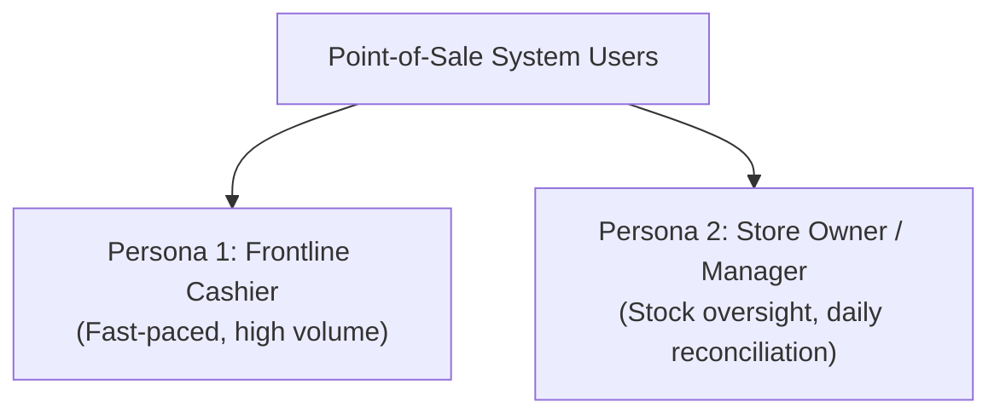

# Product Specification & Requirements

This document defines the product vision, user personas, core feature requirements, business rules, and user journeys for the ** Point-of-Sale System System**.

---

## 1. Product Vision & Value Proposition

### 1.1 Executive Summary
Most Point of Sale (POS) systems require expensive hardware, complex cloud databases, and monthly recurring software subscriptions that are cost-prohibitive for small retail stores, cafes, and pop-up businesses.

** Point-of-Sale System** provides a **zero-maintenance, serverless, Bring-Your-Own-Sheet (BYOS)** POS terminal that runs on any device (tablet, laptop, phone) and stores 100% of data directly in the merchant's personal Google Drive via Google Sheets.

### 1.2 Core Pillars
1. **Zero Recurring Infrastructure Costs**: No EC2, Supabase, Firebase, or SQL servers to pay for or maintain.
2. **Total Data Ownership**: Every sale, inventory change, and staff record is stored in a standard Google Sheet that the merchant can open, export, or analyze anytime.
3. **Frictionless Speed**: Designed with a touch-first, tap-to-add interface, quick tender shortcuts, and 80mm thermal receipt printing.

---

## 2. User Personas

### Persona 1: Frontline Cashier (e.g. Maria, Coffee Shop Barista)
- **Goals**: Ring up items in seconds, avoid miscalculating change, print receipts instantly.
- **Pain Points**: Complicated menus, laggy checkout buttons, slow payment tender entry.
- **Needs**: Tap-to-add cards, visual confirmation of items in cart, quick tender shortcuts (`Exact`, `+100`, `+500`), automatic change calculation.

### Persona 2: Store Owner / Manager (e.g. Carlo, Small Business Owner)
- **Goals**: Monitor daily revenue, track cashier performance, maintain inventory levels without being locked into proprietary software.
- **Pain Points**: Monthly SaaS subscriptions, complex API setups, proprietary data export formats.
- **Needs**: Direct access to raw sales data in Google Sheets, easy product additions, simple 1-click database setup.

---

## 3. Feature Breakdown

### 3.1 POS Register & Catalog Management
- **Tap-to-Add Product Cards**:
  - Entire card is a clickable button (`active:scale-[0.98]` tactile feel).
  - Top-right active badge (`✓ {count}`) shows how many units are currently in the order.
  - Automatic visual feedback for low stock (≤ 10 items) and disabled states for out-of-stock items.
- **Search & Category Filtering**:
  - Real-time search across product names and IDs.
  - Category pill filter with horizontal scrolling.
  - Instant search clear (`X`) button.
- **In-App Item Creation**:
  - `+ New Item` modal allows store staff to append new products directly to the Google Sheet from the register.

### 3.2 Order & Checkout Flow
- **Active Cart Panel**:
  - Itemized rows displaying product name, unit price, quantity steppers (`[-] [qty] [+]`), and line subtotal.
  - Minimum 32px touch targets for quantity steppers with hover/press states.
  - One-click item removal (`X`) and whole-order clearing (`Trash`).
- **Financial Calculations**:
  - Real-time subtotal, percentage discounts (`0%`, `5%`, `10%`, `15%`), and net total due.
  - All figures formatted with `tabular-nums font-mono` to prevent layout jitter.
- **Cash Tender & Change Computation**:
  - Input field for custom cash amounts.
  - Fast-bill shortcuts: `Exact`, `+100`, `+200`, `+500`, `+1000`.
  - Dynamic color-coded change indicator: Emerald for valid change, Rose for underpayment.
- **Charge Action CTA**:
  - High-contrast, full-width button displaying the live total (`Charge ₱350.00`).
  - Disabled when cart is empty or cash tendered is less than total due.

### 3.3 Cashier Tracking
- **Multi-Cashier Support**:
  - Dynamically populated dropdown in the sticky header fetched from the `Cashiers` sheet.
  - Displays `Nickname (Full Name)` for easy identification.
  - Cashier name is permanently stamped on each sales record and receipt.
- **Default Cashier Preference**:
  - Configurable from the Settings page and persisted in local storage.

### 3.4 Thermal Receipt Printing
- **Itemized Modal**:
  - Shows store name, receipt number, cashier nickname, date/time timestamp.
  - Lists all purchased products with quantities, unit prices, and line totals.
  - Displays subtotal, discount, net total, cash tendered, and change.
  - Customizable footer message (e.g. "Thank you for your business!").
- **80mm Thermal Printer Integration**:
  - Custom `@media print` CSS formats the receipt for standard 80mm thermal paper.
  - Automatically hides web UI, navigation headers, and modal buttons during print.

### 3.5 Bring-Your-Own-Sheet (BYOS) Settings Hub
- **1-Click Template Copy**: Direct link opening Google Drive's `/copy` dialog to duplicate the official spreadsheet template.
- **Interactive Setup Guide**: 5-step accordion guide walking through Apps Script deployment, Google account authorization, and "unsafe" warning handling.
- **Connection Diagnostics**: Measures live ping latency (ms) and counts active products in the sheet.
- **Store Profile Customization**: Store name, currency symbol selector (`₱`, `$`, `€`, `£`, `¥`, `RM`, `₹`, or custom), and receipt footer.

---

## 4. Business Rules & Validations

1. **Price Integrity**: Client-submitted prices are ignored during checkout. Apps Script fetches prices directly from the `Products` sheet.
2. **Stock Depletion**: If an item in the cart exceeds available stock at the moment of checkout, the transaction is rejected with an explanatory error.
3. **Negative Stock Prevention**: Inventory counts cannot fall below zero.
4. **Underpayment Protection**: A transaction cannot be charged if `cashTendered < totalDue`.
5. **Inactive Items**: Items marked `active = FALSE` are hidden from the catalog and rejected by the API if an order attempts to include them.

---

## 5. Non-Functional Requirements

- **Performance**: Sub-200ms client UI interaction response. Under 1.5s end-to-end checkout synchronization over Google Apps Script.
- **Reliability**: Zero data loss via Google Apps Script `LockService` concurrency control.
- **Accessibility**: High-contrast text meeting WCAG AA standards (4.5:1 minimum contrast), min 44px touch targets on primary actions, visible focus indicators.
- **Offline Readiness**: PWA manifest and service worker precaching static assets for fast startup.
