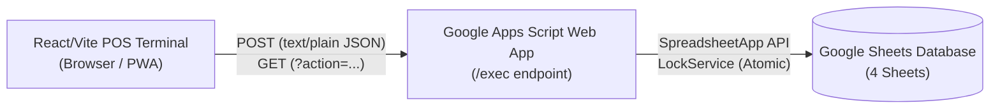

# POS System Setup & Verification Guide

This guide walks you through setting up **Google Sheets as the database** and **Google Apps Script as the API backend**, and verifying the integration with your local or deployed POS frontend.

---

## Architecture Overview



---

## Step 1: Create the Google Sheets Database

You can either:
- **Option A (Recommended - 1-Click)**: Use the **Make a Copy** button in the app's **Settings** tab to duplicate the official template into your Google Drive.
- **Option B (Manual)**: Follow the manual creation steps below.

### Manual Sheet Setup:
1. Open [Google Sheets](https://sheets.new) in your browser.
2. Name the spreadsheet: `POS_DATABASE`.
3. Create the following **4 sheets (tabs)** with their exact header row names:

#### 1. Sheet: `Products`
In the first tab, rename it to `Products` and add the following headers in Row 1:

| Column A | Column B | Column C | Column D | Column E | Column F |
| :--- | :--- | :--- | :--- | :--- | :--- |
| **id** | **name** | **price** | **stock** | **category** | **active** |

Initial sample data:

| id | name | price | stock | category | active |
| :--- | :--- | :--- | :--- | :--- | :--- |
| `P001` | Coke | 25 | 50 | Drinks | `TRUE` |
| `P002` | Burger | 120 | 20 | Food | `TRUE` |
| `P003` | Fries | 60 | 30 | Food | `TRUE` |
| `P004` | Ice Cream (Inactive) | 45 | 10 | Dessert | `FALSE` |

#### 2. Sheet: `Sales`
Create a second tab, rename it to `Sales`, and add the following headers in Row 1:

| Column A | Column B | Column C | Column D | Column E | Column F | Column G | Column H |
| :--- | :--- | :--- | :--- | :--- | :--- | :--- | :--- |
| **sale_id** | **date** | **cashier** | **subtotal** | **discount** | **total** | **payment** | **change** |

*Leave Row 2 onwards empty. The backend will append completed transactions here.*

#### 3. Sheet: `SaleItems`
Create a third tab, rename it to `SaleItems`, and add the following headers in Row 1:

| Column A | Column B | Column C | Column D | Column E | Column F |
| :--- | :--- | :--- | :--- | :--- | :--- |
| **sale_id** | **product_id** | **product_name** | **quantity** | **price** | **subtotal** |

*Leave Row 2 onwards empty. The backend will append purchased line items here.*

#### 4. Sheet: `Cashiers`
Create a fourth tab, rename it to `Cashiers`, and add the following headers in Row 1:

| Column A | Column B | Column C | Column D |
| :--- | :--- | :--- | :--- |
| **id** | **fullName** | **nickname** | **active** |

Initial sample data:

| id | fullName | nickname | active |
| :--- | :--- | :--- | :--- |
| `C001` | Carlo Dandan | Carlo | `TRUE` |
| `C002` | Maria Santos | Maria | `TRUE` |
| `C003` | Juan Dela Cruz | Juan | `TRUE` |
| `C004` | Inactive Staff | Ghost | `FALSE` |

*The POS terminal automatically detects all active cashiers and populates the **Cashier** dropdown selector in the navigation bar.*

---

## Step 2: Create the Apps Script Project

1. In your Google Sheet, click **Extensions** ➔ **Apps Script**.
2. Replace all the default code in `Code.gs` with the code in:
   [`google-apps-script/Code.js`](../google-apps-script/Code.js)
3. *(Optional if container-bound)*: Copy the spreadsheet ID from your browser's address bar:
   `https://docs.google.com/spreadsheets/d/`**`YOUR_SPREADSHEET_ID`**`/edit`
   And paste it into line 13:
   ```javascript
   const SPREADSHEET_ID = 'YOUR_SPREADSHEET_ID';
   ```
   *(If container-bound, `getActiveSpreadsheet()` works automatically as fallback)*.
4. Click the **Save** icon (disk).

> [!TIP]
> **One-Click Auto-Initializer**: You can select `setupDatabaseSheets` in the Apps Script function dropdown and click **Run** to automatically initialize all 4 sheets and headers with sample data!

---

## Step 3: Deploy Apps Script as a Web App

1. In the top right corner of the Apps Script editor, click **Deploy** ➔ **New deployment**.
2. Click the gear icon next to "Select type" (top left of the dialog) and choose **Web app**.
3. Configure the deployment settings:
   - **Description**: `POS Web App API v1`
   - **Execute as**: `Me (<your-email@gmail.com>)`
   - **Who has access**: `Anyone` *(Crucial: This enables the browser POS frontend to communicate with your backend without requiring cashiers or customers to log into Google)*.
4. Click **Deploy**.

---

### Step 3.1: Authorize Access & Bypass the "Unsafe" Warning

When deploying for the first time, Google Apps Script requires you to authorize the script to access your Google Sheets. Because this is a custom, self-hosted script that hasn't gone through Google's commercial OAuth verification process, Google will present a security warning.

Follow these steps to complete authorization:

1. **Authorization Prompt**:
   - A dialog titled **"Authorization required"** will appear.
   - Click **Authorize access** (or **Review permissions**).

2. **Choose Account**:
   - Select your Google account from the popup window.

3. **Google Security Warning Screen ("Google hasn't verified this app")**:
   - Google will show a warning screen saying:
     > *"Google hasn't verified this app. The app wants to access sensitive info in your Google Account. Until the developer verifies this app with Google, you shouldn't use it."*

4. **Click "Advanced"**:
   - Near the bottom-left of the warning card, click the small link titled **Advanced**.

5. **Proceed via "Go to POS API (unsafe)"**:
   - In the expanded text section, click **Go to POS API (unsafe)** (or your project's name).

6. **Grant Permissions**:
   - The permissions screen (*"POS API wants to access your Google Account"*) will outline the scopes (such as viewing and managing spreadsheets in Google Drive).
   - Scroll to the bottom and click **Allow**.

7. **Copy Your Live Web App URL**:
   - Once authorized, the deployment modal will display your new **Web App URL**:
     ```
     https://script.google.com/macros/s/AKfycb.../exec
     ```
   - Click **Copy** to copy this URL to your clipboard.

> [!WARNING]
> **Why Does Google Show an "Unsafe" Warning?**
> - **Standard Google Safeguard**: Google displays this warning for *all* private, developer-created Apps Scripts that have not been submitted for official Google Cloud OAuth verification.
> - **Shared Web App Access**: Because the script executes as **Me** and access is set to **Anyone**, **anyone who has access to your Web App URL can read and modify anything in your spreadsheet database** (e.g. products, sales history, cashiers).
> - **Keep Your URL Secure**: Treat your Web App URL as an API secret key. Do not post it publicly or commit it to public GitHub repositories. Only paste it into your POS terminal's **Settings** tab or your local `.env.local` file.

---

## Step 4: Connect the React POS Terminal

You can configure the URL in two ways:

### Option A: In-App Settings (Zero Code)
1. Open the POS app in your browser.
2. Go to the **Settings** tab (or click **Setup Required**).
3. Paste the Web App URL into the **Google Apps Script Web App URL** input.
4. Click **Test Connection** to verify latency and product count.
5. Click **Save & Connect**.

### Option B: Local Environment Variable
1. In the project root, open or create `.env.local`.
2. Set `VITE_POS_API_URL`:
   ```env
   VITE_POS_API_URL=https://script.google.com/macros/s/AKfycb.../exec
   ```
3. Restart the Vite dev server (`pnpm dev`).

---

## Step 5: Verification & Testing

### 1. Catalog Sync
- Navigate to the **Register** tab.
- Active items (`P001`, `P002`, `P003`) should display as clickable cards.
- Inactive items (`P004`) should be excluded.

### 2. Transaction Flow & Stock Decrement
1. Click **Burger** twice and **Fries** once.
2. In the checkout panel, verify the total is `₱300.00`.
3. Click the `₱500` quick cash button (change should calculate to `₱200.00`).
4. Click **Charge ₱300.00**.
5. When the receipt modal appears, verify:
   - Itemized lines: 2x Burger, 1x Fries.
   - Cashier name matches the header selection.
   - Total, payment, and change are accurate.
6. Check your Google Sheet:
   - `Sales`: Contains new sale row.
   - `SaleItems`: Contains 2 new line item rows.
   - `Products`: Burger stock reduced by 2; Fries stock reduced by 1.

### 3. Adding New Products
1. Click **+ New Item** in the catalog toolbar.
2. Enter Name, Category, Price, and Stock.
3. Click **Add Product**.
4. The product is immediately appended to the `Products` sheet and appears in the catalog.

### 4. Automated CLI Testing
Run the automated end-to-end integration test suite directly from your terminal:

```bash
node scripts/test-api.mjs "https://script.google.com/macros/s/YOUR_SCRIPT_ID/exec"
```
